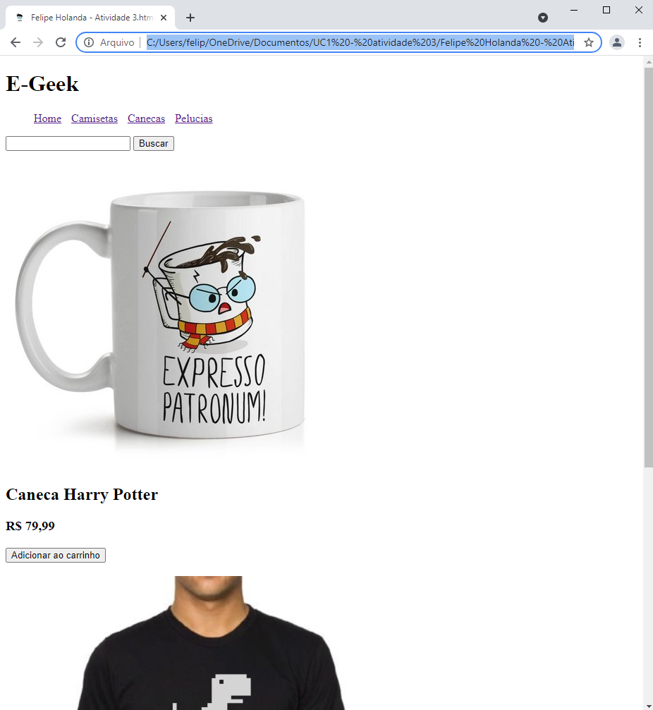

<!-- Badges -->

   

<!--Sobre o projeto-->
## 💻 Sobre o projeto

Fazer um site de uma loja Geek.

Projeto feito para meu curso tecnico em informação para a Internet do SENAC EAD, projeto de desenvolvimento ao decorrer dos modulos.

## 🚀  Tecnologias
- [x] **HTML**
- [x] **CSS**

#### Ferramentas
- [**VS CODE**]()

#### Imagem do Site

<h1 aling="center">
   
</h1>

<h4 align=center>Desenvolvido por Felipe Holanda <a href="https://www.linkedin.com/in/felipe-holanda-de-freitas-3a91281a2/"> <strong>Entre em contato</strong> :)</a></a></h4>

